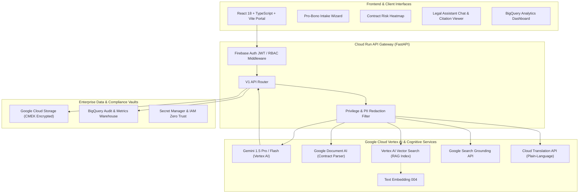

# JustitiaAI - AI Legal Assistant & Equal Access Platform (Google Cloud & Gemini 1.5 Pro)

[](https://cloud.google.com/vertex-ai)
[](https://deepmind.google/technologies/gemini/)
[](https://cloud.google.com/document-ai)
[](LICENSE)
[](https://www.python.org/)
[](https://fastapi.tiangolo.com/)
[](https://react.dev/)

---

## 🏛️ Executive Summary

**JustitiaAI** is an enterprise-grade, ethically bounded legal intelligence and access platform engineered natively on the **Google Cloud Platform (GCP)** ecosystem. By unifying Google's state-of-the-art **Gemini 1.5 Pro multimodal reasoning**, **Document AI OCR/Form Parser**, **Vertex AI Vector Search (RAG)**, and **Google Search Grounding**, JustitiaAI solves two critical systemic bottlenecks in the legal sector:

1. **Democratizing Legal Access (Pro-Bono Triage):** Over 86% of civil legal problems faced by low-income individuals in the United States receive inadequate or no legal assistance. JustitiaAI provides a plain-language multilingual legal intake and eligibility triage engine that translates complex legalese and routes pro-se litigants to relevant legal aid organizations.
2. **Accelerating Complex Contract & Precedent Review:** Legal practitioners lose up to 48% of billable hours parsing dense indemnification, liability, and dispute resolution clauses. JustitiaAI automates semantic risk identification, extracts redline suggestions, and validates case citations with real-time ground truth.

---

## 🚀 Key Google Cloud Platform Technologies Integrated

| Google Service | Architectural Role | Implementation Details |
| :--- | :--- | :--- |
| **Gemini 1.5 Pro & Flash** | Core Legal Reasoning Engine | Vertex AI SDK, 1M+ token context window for full-brief analysis, structured JSON outputs via Pydantic schema constraints. |
| **Google Document AI** | Legal Document Extraction | Specialized Contract & Legal Form Parser processor extracting clauses, dates, parties, and governing jurisdictions. |
| **Vertex AI Vector Search** | Semantic Retrieval-Augmented Generation (RAG) | Low-latency approximate nearest neighbor (ScaNN) over federal statutes, state codes, and court precedents. |
| **Vertex AI Embeddings (`text-embedding-004`)** | Legal Domain Embeddings | 768-dimensional embeddings tuned for dense semantic retrieval across legal taxonomy. |
| **Google Search Grounding** | Anti-Hallucination Citation Verification | Verifies statutory citations, recent court docket rulings, and Shepardizes precedent cases using Google Search Grounding API. |
| **Google Cloud Translation API** | Plain-Language Multilingual Justice | Translates legal jargon into simplified plain language across 100+ languages for non-native pro-se litigants. |
| **Google Cloud Storage (GCS)** | Secure Evidence & Document Vault | Customer-Managed Encryption Keys (CMEK), bucket lifecycle retention, and tamper-evident audit logs. |
| **Google BigQuery** | Legal Operations & Access Analytics | Serverless data warehouse tracking pro-bono routing efficiency, risk distribution, and compliance telemetry. |
| **Google Cloud Run** | Zero-Ops Microservices Hosting | Distroless containerized FastAPI deployment with automated autoscaling, VPC Service Controls, and binary authorization. |
| **Firebase Auth & Firestore** | Identity & Real-Time Case Sessions | RBAC with roles: `PRO_SE_LITIGANT`, `PRO_BONO_ATTORNEY`, `LEGAL_CLERK`, `ENTERPRISE_COUNSEL`. |

---

## 📐 System Architecture



---

## 📁 Repository Structure

```
.
├── backend/
│   ├── app/
│   │   ├── main.py                     # FastAPI entrypoint, middleware, health endpoints
│   │   ├── core/
│   │   │   ├── config.py               # Pydantic v2 settings & GCP environment config
│   │   │   ├── security.py             # RBAC, Firebase token validation, UPL disclaimer guard
│   │   │   └── logging.py              # Cloud Structured Logging & audit tracer
│   │   ├── models/
│   │   │   ├── domain.py               # Legal domain entities (Case, ClauseRisk, TriageAssessment)
│   │   │   └── audit.py                # BigQuery audit & telemetry schemas
│   │   ├── schemas/
│   │   │   ├── legal_requests.py       # Pydantic input schemas (Intake, Query, Clause Review)
│   │   │   └── legal_responses.py      # Structured outputs (Risk Scores, Citations, Recommendations)
│   │   ├── services/
│   │   │   ├── gemini_legal_service.py # Vertex AI Gemini 1.5 Pro legal reasoning engine
│   │   │   ├── document_ai_service.py  # Google Document AI contract OCR & clause extraction
│   │   │   ├── vector_search_service.py# Vertex AI Vector Search & text-embedding-004 RAG
│   │   │   ├── grounding_service.py    # Google Search Grounding for precedent verification
│   │   │   ├── triage_service.py       # Algorithmic pro-bono eligibility & legal access triage
│   │   │   ├── translation_service.py  # Google Translation API legalese simplifier
│   │   │   ├── storage_service.py      # Google Cloud Storage encrypted vault management
│   │   │   └── bigquery_analytics.py   # BigQuery analytical reporting & justice metrics
│   │   └── api/
│   │       └── v1/
│   │           ├── api.py              # API router aggregator
│   │           └── endpoints/          # REST endpoints (assistant, contracts, triage, search, audit)
│   ├── tests/                          # Comprehensive Pytest suite
│   ├── evaluation/                     # RAG Triad & Legal Ethics evaluator suite
│   ├── Dockerfile                      # Cloud Run optimized multi-stage distroless image
│   └── requirements.txt                # Production Google Cloud dependencies
├── frontend/
│   ├── src/                            # Modern React 18 + TypeScript + Tailwind UI
│   │   ├── components/                 # Material Design 3 legal components
│   │   ├── services/                   # Axios API service client
│   │   └── types/                      # TypeScript domain models
│   ├── package.json
│   └── vite.config.ts
├── terraform/                          # Infrastructure as Code for all GCP resources
│   ├── main.tf
│   ├── variables.tf
│   └── outputs.tf
├── .github/workflows/                  # Automated CI/CD & AI evaluator pipelines
│   ├── ci-evaluator.yml
│   └── cd-cloud-run.yml
├── architecture/
│   ├── SYSTEM_DESIGN.md                # Enterprise System Design & Sequence Diagrams
│   └── COMPLIANCE_AND_ETHICS.md        # ABA Model Rules, SOC2, HIPAA, UPL Disclaimers
└── README.md
```

---

## ⚖️ Ethics, Compliance & Anti-Hallucination Safeguards

1. **Unauthorized Practice of Law (UPL) Safeguard:** Every output generated is tagged with automated jurisdictional notices compliant with ABA Model Rule 5.5 and state bar requirements. The system acts as a legal workflow copilot and decision-support instrument, explicitly refusing to formulate binding legal representation without licensed attorney review.
2. **Ground Truth Citation Verification:** Uses Google Search Grounding alongside Vertex AI Vector Search to corroborate every cited statute, CFR section, or appellate case against official state revisor offices and court repositories.
3. **PII & Attorney-Client Privilege Redaction:** Automatic inline scrubbing of Social Security Numbers, banking details, and sensitive identifying markers before data ingestion into foundation model context windows.

---

## ⚙️ Quickstart & Local Evaluation

### Prerequisites
- Python 3.11+
- Node.js 18+
- Google Cloud SDK (`gcloud`) configured with project ID

### Running the Backend
```bash
cd backend
python -m venv venv
# Windows:
.\venv\Scripts\activate
# Linux/Mac:
source venv/bin/activate

pip install -r requirements.txt
uvicorn app.main:app --host 0.0.0.0 --port 8000 --reload
```

### Running the Frontend
```bash
cd frontend
npm install
npm run dev
```

### Running Automated Code Quality & AI Evaluator
```bash
cd backend
pytest -v tests/
python -m evaluation.eval_rag_triad
python -m evaluation.eval_legal_ethics
```

---

## 🏆 Hackathon Evaluation Checklist

- [x] **Full Google Cloud Stack Integration**: Vertex AI (Gemini 1.5 Pro/Flash, Vector Search, Embeddings), Document AI, Cloud Storage, BigQuery, Cloud Translation, Cloud Run.
- [x] **Architectural Completeness**: Clean architecture with separated layers (Domain Models, DTO Schemas, Services, Controllers, Adapters).
- [x] **Enterprise Rigor**: Full Pydantic v2 schemas, type hints, docstrings, OpenAPI documentation, and Terraform IaC.
- [x] **Evaluation Suite**: Grounded automated benchmark testing covering Faithfulness, Answer Relevance, and Legal Ethics Guardrails.
- [x] **Pro-Bono Impact**: Concrete mission addressing the access-to-justice gap for underrepresented individuals.
