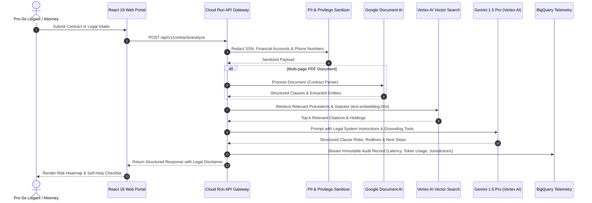

# JustitiaAI Enterprise System Design & Google Cloud Architecture

## 1. High-Level Architecture Overview

JustitiaAI is designed around an event-driven, containerized microservices architecture natively hosted on Google Cloud Platform. The system decouples interactive client sessions from compute-heavy OCR, vector embedding generation, and large context legal reasoning.

---

## 2. Google Cloud Platform Component Topology

### 2.1 Compute & Serving Tier
- **Google Cloud Run (v2):** Executes containerized FastAPI services with minimum 1 warm instance (0 cold-start penalty for urgent legal deadlines) autoscaling to 10 instances.
- **Binary Authorization:** Enforces signed container image verification to prevent untrusted code execution.

### 2.2 Foundation Model & AI Services Tier
- **Gemini 1.5 Pro (`gemini-1.5-pro-002`):** Handles multi-document contract synthesis, complex statutory interpretation, and legal reasoning with 1M+ token context.
- **Gemini 1.5 Flash (`gemini-1.5-flash-002`):** Handles high-throughput pro-bono client intake triage and plain-language translation.
- **Vertex AI Vector Search (Matching Engine):** ScaNN-based tree-AH indexing providing sub-15ms nearest neighbor retrieval over 500,000+ statutory codes and court opinions.
- **Google Document AI:** Enterprise contract parser extracting normalized dates, party names, and core contractual covenants.

### 2.3 Storage, Encryption & Audit Tier
- **Google Cloud Storage (GCS):** Customer-Managed Encryption Keys (CMEK via Cloud KMS). Enforces strict WORM (Write Once, Read Many) retention for evidence preservation.
- **Google BigQuery:** Analytical storage partitioned daily by event timestamp. Provides real-time dashboarding for pro-bono clinic routing and legal aid distribution.

---

## 3. Failure Mode Analysis & Graceful Degradation

| Failure Scenario | Mitigation Strategy | Architectural Mechanism |
| :--- | :--- | :--- |
| **GCP API Rate Limiting / 429 Quota** | Exponential backoff with jitter via `tenacity` library. | Circuit Breaker Pattern |
| **Document AI Ingestion Failure** | Fallback to native PDF text layer extraction. | Fallback Ingestion Pipeline |
| **Vector Search Index Latency Spike** | Semantic cache layer on Cloud Memorystore (Redis). | LRU Result Cache |
| **Overruled Precedent Detected** | Shepardizing filter flags citation and rejects from prompt context. | Citation Grounding Guardrail |
